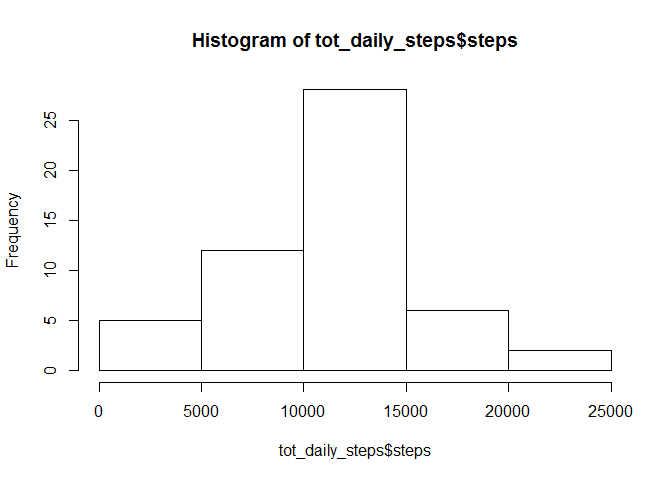

# Reproducible Research: Peer Assessment 1


## Loading and preprocessing the data

Set the working directory and load the data.

```r
setwd("C://Work//docs//PaulWork//Data_Science_Course//reproducable research//week2_ass")
rawdata <- read.csv("activity.csv")
```

convert the strings in the 'date' field to date format, then remove the records with no reading (NA)

```r
rawdata$date <- as.POSIXct(rawdata$date,format="%Y-%m-%d")
data_readings <- na.omit(rawdata)
```

## What is mean total number of steps taken per day?

Calculate the total number of steps taken per day

```r
tot_daily_steps <- aggregate(steps ~ date,data=data_readings,sum)
```

Make a histogram of the total number of steps taken each day

```r
hist(tot_daily_steps$steps)
```

 

Calculate and report the mean and median of the total number of steps taken per day

```r
summary(tot_daily_steps$steps)
```

```
##    Min. 1st Qu.  Median    Mean 3rd Qu.    Max. 
##      41    8841   10760   10770   13290   21190
```

## What is the average daily activity pattern?

Time series plot

Make a time series plot (i.e. type = "l") of the 5-minute interval (x-axis) and the average number of steps taken, averaged across all days (y-axis)

```r
ave_num_steps <- aggregate(steps ~ interval,data=data_readings,mean)
plot(ave_num_steps, type="l")
```

 

Show which 5-minute interval, on average across all the days in the dataset, contains the maximum number of steps


```r
sortedata <- ave_num_steps[order(-ave_num_steps$steps),]
max_interval <- sortedata [1,1]
max_steps <-round((sortedata [1,2]), digits = 0)  
```
The interval 835 contains the maximum number of steps, which is 206 steps.


## Imputing missing values

Total number of missing values in the dataset

```r
sum(is.na(rawdata$steps))
```

```
## [1] 2304
```

```r
missing <- subset(rawdata, (is.na(steps)))
```

Fill in the missing values in the dataset

```r
missing_modelled <- merge(missing, ave_num_steps, by="interval") ##use the average values
missing_modelled <-  subset(missing_modelled, , select = c(interval, date, steps.y)) ##subset just the 3 wanted columns
colnames(missing_modelled)[colnames(missing_modelled)=="steps.y"] <- "steps" ##rename column to match the raw data
full_modelled <- rbind(data_readings, missing_modelled) ##add the modelled rows to the rows without missing data to create a full dataset
```

Repeat the observations that were made with the non-modelled readings

```r
tot_daily_steps_m <- aggregate(steps ~ date,data=full_modelled,sum)
hist(tot_daily_steps_m$steps)
```

 

```r
summary(tot_daily_steps_m$steps)
```

```
##    Min. 1st Qu.  Median    Mean 3rd Qu.    Max. 
##      41    9819   10770   10770   12810   21190
```

What difference did including the modelled data make?

```r
 diff_median <- median(tot_daily_steps$steps) - median(tot_daily_steps_m$steps)
diff_mean <- mean(tot_daily_steps$steps) - mean(tot_daily_steps_m$steps)
```

The diference in the mean from using modelled values is 0.
The diference in the median from using modelled values is -1.1886792.

Including modelled data has not influenced to histogram very much or the average values.

## Are there differences in activity patterns between weekdays and weekends?

Create a weekday / weekend factor

```r
day_values <- (weekdays(full_modelled$date)) ##create a temporary vector with the days of the week for each observation
full_modelled$weekdays <- as.factor(day_values) ##create a new extra column for the weekday/weekend data
levels(full_modelled$weekdays) <- c("weekday", "weekday", "weekday", "weekday","weekday", "weekend", "weekend") ##define that the week starts on Monday
full_modelled_week <- full_modelled[which(full_modelled$weekdays == "weekday"),] ##subset just weekdays
full_modelled_weekend <- full_modelled[which(full_modelled$weekdays == "weekend"),] ##subset just weekends

ave_num_steps_week <- aggregate(steps ~ interval,data=full_modelled_week,mean)
ave_num_steps_weekend <- aggregate(steps ~ interval,data=full_modelled_weekend,mean)
```

Create a plot comparing weekday / weekend

```r
par(mar=c(3.0, 3.0, 1.5, 1.5)) ##increase the plot window
par(mfcol = c(2, 1)) ##create an area one plot wide and two high
plot(ave_num_steps_week, type="l",main = "Av. num. weekday steps")
plot(ave_num_steps_weekend, type="l",main = "Av. num. weekend steps")
```

 
